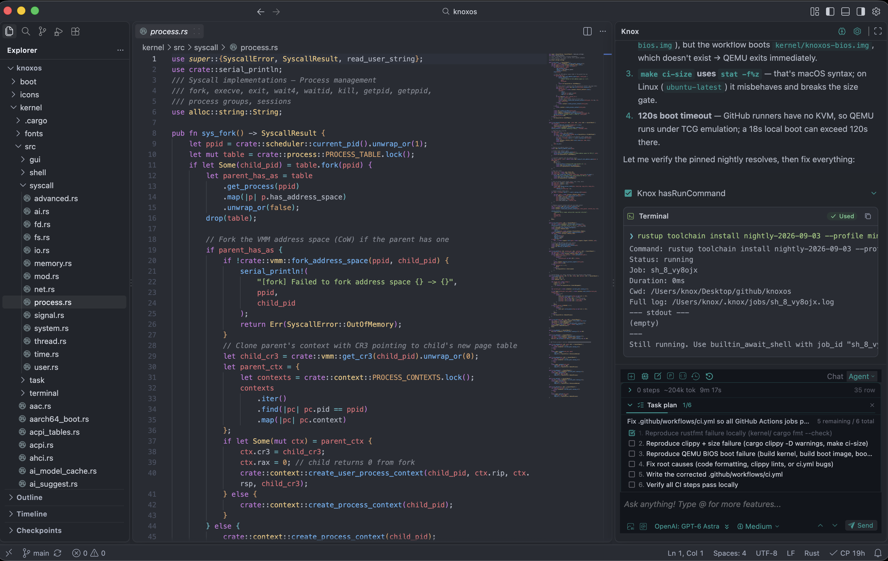
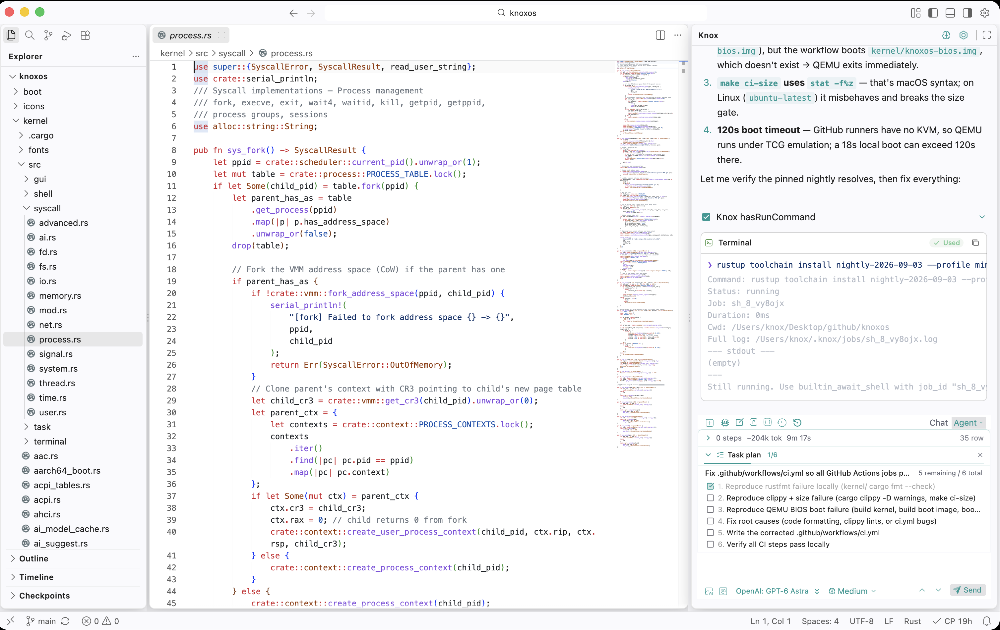

# KnoxCoder

KnoxCoder is a code editor based on [Visual Studio Code](https://code.visualstudio.com) open source.

|  |
|-|

|  |
|-|

## Knox

Knox (sidebar chat, agent, Memory Brain, checkpoints) is a **system extension** (`vscode.knox`), the same class as Git. Linux and Windows CI package it with `packageNativeLocalExtensionsStream` (host `dist/`, webview `gui/`, platform sqlite). macOS uses `./build_dmg.sh` (no GitHub Actions macOS job). It is in the editor on first launch — **no Open VSX install**.

- **Disable:** Extensions view → Knox → Disable. It cannot be uninstalled.
- **Do not install** `knoxchat.knoxchat` from the marketplace in KnoxCoder. That id is hidden, blocked from install, and disabled if a leftover user copy is present.
- **Vanilla VS Code / Open VSX:** this fork does **not** publish Knox as a store VSIX. Marketplace Knox stays in the separate **kc** product tree (Knox 1.4.6) for vanilla VS Code only.

Command, view, and setting IDs stay `knoxchat.*` so existing keybindings and `settings.json` keep working.

## Documentation

* [KnoxCoder documentation](https://code.visualstudio.com/docs)
* [How to Contribute](https://github.com/microsoft/vscode/wiki/How-to-Contribute)
* [Development Setup](https://github.com/microsoft/vscode/wiki/How-to-Contribute#build-and-run-from-source)

## License

Copyright (c) Microsoft Corporation. All rights reserved.

Licensed under the [MIT](LICENSE.txt) license.
